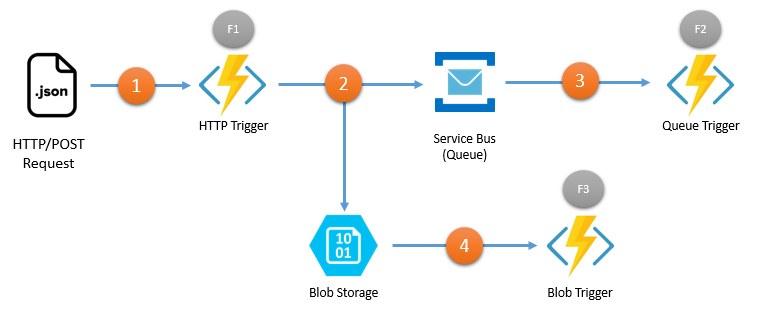
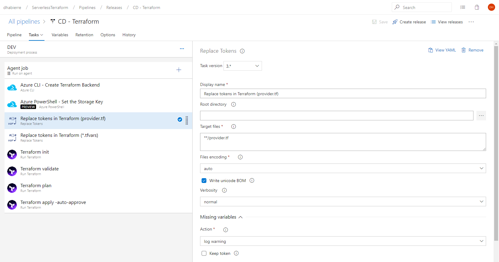
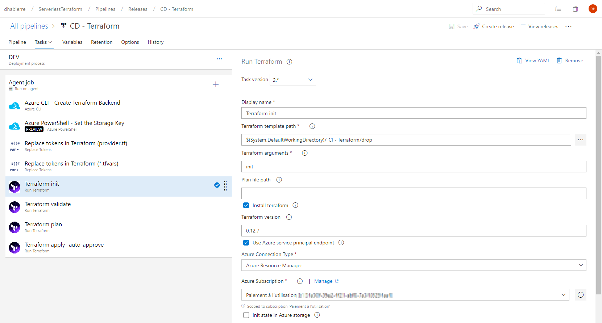
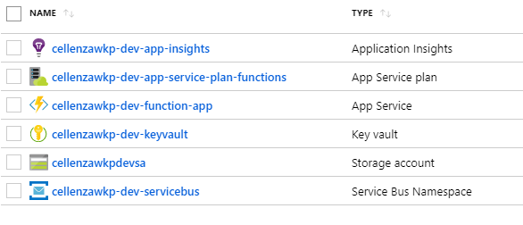

# Déployer un process Serverless avec Terraform & Azure DevOps

## Terraform

[Terraform](https://www.terraform.io/) est un outil open-source développé par [HashiCorp](https://www.hashicorp.com/products/terraform/), utilisé pour provisionner et gérer des infrastructures IT dans le cloud. Ecrit en Go et fonctionnant en mode Infrastructure as a Code, il permet d’administrer l’infrastructure grâce à du code au lieu de procéder à un ensemble d'opérations manuelles.

La force de Terraform est de reposer sur un langage de description d'infrastructure simple et lisible : le HCL. L'approche IAC de Terraform permet de gérer le versioning d'une infrastructure en lui ajoutant ou retirant des composants.

Pour débuter avec Terraform :

- [Comment déployer votre infrastructure Azure en toute sécurité avec Terraform](https://blog.cellenza.com/cloud-2/azure/comment-deployer-votre-infrastructure-azure-en-toute-securite-avec-terraform/)
- [Provisionner votre infrastructure Azure avec Terraform](https://blog.cellenza.com/cloud-2/azure/provisionner-votre-infrastructure-azure-avec-terraform/)
- [Comment utiliser Terraform dans Azure DevOpS](https://blog.cellenza.com/devops/comment-utiliser-terraform-dans-azure-devops/)

## Objectif

Dans cet article, nous allons voir :

1. comment mettre en place un traitement à base d'**Azure Functions**,
2. utiliser conjointement **Terraform** et **Azure DevOps** dans l'optique de déployer l'infrastructure Azure, de manière automatique et continue.

Notre architecture d'exemple se compose de la façon suivante :

- 3 **Azure Functions**, ayant des types de trigger différents,
- 1 **Blob Storage**, pour persister les données reçues,
- 1 **Service Bus**, exposant une **Queue**.



Le scénario est le suivant :

- (1) une requête HTTP/POST est initiée sur la function _F1_,
- (2) la function _F1_ enregistre le body de la requête (JSON) dans le _Blob Storage_ et poste un message (contenant le lien du blob) sur la _Queue_,
- (3) la function _F2_ se déclenche, charge le JSON depuis le _Blob Storage_ et fait un traitement,
- (4) la function _F3_ se déclenche et fait un autre traitement.

L'intérêt de persister les données de la requête HTTP dans un blob est double :

- garder une trace des requêtes pour éventuellement les rejouer en debug,
- la taille des messages sur la queue du ServiceBus est limitée.

Nous allons :

- créer la stack Terraform pour la description déclarative de l'infrastructure,
- créer la solution Visual Studio contenant les Azure Functions,
- mettre en place la CI/CD avec Azure Pipelines pour l'intégration & le déploiement continu.

## Sources

Les sources de la stack Terraform et de la solution Visual Studio sont disponibles sur [ce repository](http://).

Avant tout, réalisez les actions ci-dessous :

- Créez un repository sur Azure DevOps,
- Uploadez les sources dessus.

## Prérequis

- [Terraform 0.12.5](https://chocolatey.org/packages/terraform)
- [Visual Studio 2019](https://visualstudio.microsoft.com/vs/)

Note : l'installation de Terraform sur votre poste n'est pas nécessaire. Cependant, cela peut être utile pour lancer les commandes _valide_ et _plan_ localement avant de commiter les modifications sur le repository.

Quelques outils utiles à avoir avec soi :

- [Microsoft Azure Storage Explorer](https://azure.microsoft.com/en-us/features/storage-explorer/)
- [Microsoft Service Bus Explorer](https://github.com/paolosalvatori/ServiceBusExplorer/releases)

## 1. Infrastucture

## 1. 1. Terraform

Commençons par définir l'infrastructure avec Terraform.

Remarque : toutes les variables de la forme **\_\_variablename\_\_** seront substituées lors du déploiement sur l'environnement cible.

### Fichier provider.tf

Ce fichier spécifie les versions de Terraform & du provider AzureRM à utiliser pour l'exécution de la stack.

```hcl
terraform {
  required_version = "= 0.12.5"
  # ========================================================================
  # For local execution testing 
  #  1. comment backend section
  #  2. use following commands
  # ========================================================================
  # az login
  # terraform init
  # terraform validate -var-file="variables.local.tfvars"
  # terraform plan -var-file="variables.local.tfvars" -out="out.plan"
  # terraform apply "out.plan"
  # ========================================================================
  backend "azurerm" {
    storage_account_name = "__application__sharedtfsa"
    container_name       = "terraform"
    key                  = "terraform-__environment__.tfstate"
    access_key           = "__tf_storage_account_key__"
  }
}

provider "azurerm" {
  version = "= 1.32.0"
}
```

Pour une exécution locale, il suffit de commenter au préalable le bloc **backend** (qu'il faudra évidemment décommenter avant tout commit).

### Fichier variables.tf

Ce fichier défini les différentes variables.

```hcl
variable "location" {
  type = string
}

variable "environment" {
  type = string
}

variable "application" {
  type = string
}

variable "function_f1_username" {
  type = string
}

variable "function_f1_password" {
  type = string
}
```

Dans notre exemple, les variables **function_f1_username** & **function_f1_password** seront utilisées pour une Authentification Basic au niveau de la function _F1_.

### Fichier variables.tfvars

Ce fichier affecte les valeurs des variables. Ici, ces variables tokeneurisées, seront substituées lors du déploiement sur l'environnement cible, lors de la Release dans Azure Pipelines.

```hcl
location = "__location__"
environment = "__environment__"
application = "__application__"

function_f1_username = "__function_f1_username__"
function_f1_password = "__function_f1_password__"
```

Pour exécution locale de la stack, nous pourrons utiliser le fichier **variables.local.tfvars** (cf. notes dans _provider.tf_).

```hcl
location    = "westeurope"
environment = "sandbox"
application = "local1337" # change me to be unique

function_f1_username = "localuser"
function_f1_password = "localpass"
```

### Fichier main.tf

Ce fichier contient la définition des différentes ressources Azure à créer.

Remarque : en tant que développeur, la ressource la plus intéressante est la resource **function_app / app_settings** qui définie les chaînes de connexion & autres variables qui seront utilisées dans les Azure Functions.

```hcl
resource "azurerm_function_app" "function_app" {
  
  ...

  app_settings = {
    # Runtime configuration
    FUNCTIONS_WORKER_RUNTIME        = "dotnet"
    APPINSIGHTS_INSTRUMENTATIONKEY  = azurerm_application_insights.application_insights.instrumentation_key
    # Azure Functions configuration
    KeyVaultName                    = azurerm_key_vault.key_vault.name
    StorageConnectionString         = azurerm_storage_account.storage_account.primary_connection_string
    StorageBlobContainerName        = "jsons"
    ServiceBusConnectionString      = azurerm_servicebus_namespace.servicebus_namespace.default_primary_connection_string
    ServiceBusQueueName             = "${var.application}-servicebus-queue-${local.servicebus_queue_name}"
  }

  ...
  
  # runtime version to use (~2 => latest)
  version = "~2"
}
```

- FUNCTIONS_WORKER_RUNTIME : runtime dotnet,
- APPINSIGHTS_INSTRUMENTATIONKEY : clé Application Insights pour le monitoring des functions,
- KeyVaultName : nom du KeyVault pour accéder aux secrets,
- StorageConnectionString : chaîne de connexion pour accéder au Blob Storage
- StorageBlobContainerName : nom du conteneur du blob dans lequel seront persistées les données des requêtes,
- ServiceBusConnectionString : chaîne de connexion pour accéder au Service Bus,
- ServiceBusQueueName : nom de la queue exposée par le Service Bus.

Comme nous pouvons le voir, la plupart de ces variables découlent de la stack Terraform, nous n'aurons donc jamais à les renseigner, ni dans les variables Terraform (_variables.tfvars_), ni côté Azure DevOps (variables de la Release).

Côté C# / Functions, ces variables seront injectées dans les variables d'environnement et chargées à leur habitude via l'objet **IConfigurationRoot**.

Nous pouvons remarquer qu'il n'y a pas de trace des variables pour l'authentification (_function_f1_username_ & _function_f1_password_). En effet, elles seront protégées par le KeyVault (et chargées également par **IConfigurationRoot**).

Fichier complet :

```hcl
locals {
  domain                = "${var.application}-${var.environment}"
  servicebus_queue_name = "${var.application}-servicebus-queue-client-data"

  shared_tags = {
    application  = var.application
    deployment   = "terraform"
  }

  app_tags = merge(local.shared_tags, { "environment" = var.environment })
}

# ======================================================================================
# Resource Groups
# ======================================================================================

resource "azurerm_resource_group" "resource_group" {
  location = var.location
  name     = local.domain
  tags     = local.app_tags
}

# ======================================================================================
# Storage
# ======================================================================================

resource "azurerm_storage_account" "storage_account" {
  account_replication_type = "LRS"
  account_tier             = "Standard"
  account_kind             = "StorageV2"
  location                 = azurerm_resource_group.resource_group.location
  name                     = "${replace(local.domain, "-", "")}sa"
  resource_group_name      = azurerm_resource_group.resource_group.name
  tags                     = local.app_tags
}

resource "azurerm_storage_container" "storage_container_jsons" {
  container_access_type = "private"
  name                  = "jsons"
  resource_group_name   = "${azurerm_resource_group.resource_group.name}"
  storage_account_name  = "${azurerm_storage_account.storage_account.name}"
}

# ======================================================================================
# Functions App Service Plan
# ======================================================================================

resource "azurerm_app_service_plan" "app_service_plan_functions" {
  kind                = "FunctionApp"
  location            = azurerm_resource_group.resource_group.location
  name                = "${local.domain}-app-service-plan-functions"
  resource_group_name = azurerm_resource_group.resource_group.name
  sku {
    size = "Y1"
    tier = "Dynamic"
  }
  tags = local.app_tags
}

# ======================================================================================
# FunctionApp
# ======================================================================================

resource "azurerm_function_app" "function_app" {
  name  = "${local.domain}-function-app"

  app_settings = {
    # Runtime configuration
    FUNCTIONS_WORKER_RUNTIME        = "dotnet"
    APPINSIGHTS_INSTRUMENTATIONKEY  = azurerm_application_insights.application_insights.instrumentation_key
    # Azure Functions configuration
    KeyVaultName                    = azurerm_key_vault.key_vault.name
    StorageConnectionString         = azurerm_storage_account.storage_account.primary_connection_string
    StorageBlobContainerName        = "jsons"
    ServiceBusConnectionString      = azurerm_servicebus_namespace.servicebus_namespace.default_primary_connection_string
    ServiceBusQueueName             = local.servicebus_queue_name
  }

  app_service_plan_id = azurerm_app_service_plan.app_service_plan_functions.id

  identity {
    type = "SystemAssigned" # to access to the KeyVault
  }

  location                  = azurerm_resource_group.resource_group.location
  resource_group_name       = azurerm_resource_group.resource_group.name
  storage_connection_string = azurerm_storage_account.storage_account.primary_connection_string
  tags                      = local.app_tags
  # dotnet core version (app_settings.FUNCTIONS_EXTENSION_VERSION never set/updated)
  version                   = "~2"
}

# ======================================================================================
# Application Insights
# ======================================================================================

resource "azurerm_application_insights" "application_insights" {
  name                = "${local.domain}-app-insights"
  location            = azurerm_resource_group.resource_group.location
  resource_group_name = azurerm_resource_group.resource_group.name
  application_type    = "Web"
  tags                = local.app_tags
}

# ======================================================================================
# Service Bus + Queue
# ======================================================================================

resource "azurerm_servicebus_namespace" "servicebus_namespace" {
  name                = "${local.domain}-servicebus"
  resource_group_name = azurerm_resource_group.resource_group.name
  location            = azurerm_resource_group.resource_group.location
  sku                 = "Standard"
  tags                = local.app_tags
}

resource "azurerm_servicebus_queue" "servicebus_queue" {
  name                = local.servicebus_queue_name
  resource_group_name = azurerm_resource_group.resource_group.name
  namespace_name      = azurerm_servicebus_namespace.servicebus_namespace.name
  enable_partitioning = true
}

# ======================================================================================
# KeyVault
# ======================================================================================

resource "azurerm_key_vault" "key_vault" {
  name                        = "${local.domain}-keyvault"
  location                    = azurerm_resource_group.resource_group.location
  resource_group_name         = azurerm_resource_group.resource_group.name
  tenant_id                   = data.azurerm_client_config.current.tenant_id
  enabled_for_disk_encryption = true
  sku_name                    = "standard"

  # Important: this access_policy MUST BE DEFINED INSIDE the key_vault resource otherwise
  # the process will fail the first time the secrets are added (adding secrets before access_policy created)
  access_policy {
    tenant_id = data.azurerm_client_config.current.tenant_id
    object_id = data.azurerm_client_config.current.service_principal_object_id

    key_permissions = [
      "get",
      "list",
      "create",
      "delete",
    ]

    secret_permissions = [
      "get",
      "list",
      "set",
      "delete",
    ]
  }

  lifecycle {
    ignore_changes = [access_policy]
  }

  tags = local.app_tags
}

# Important: this access_policy MUST BE DEFINED OUTSIDE the key_vault resource otherwise
# the process will fail while reading "azurerm_app_service.app_service_backend.identity.0.principal_id"
resource "azurerm_key_vault_access_policy" "key_vault_access_policy_function_app" {
  key_vault_id = azurerm_key_vault.key_vault.id
  tenant_id    = data.azurerm_client_config.current.tenant_id
  object_id    = azurerm_function_app.function_app.identity[0].principal_id

  key_permissions = [
    "get",
    "list",
  ]

  secret_permissions = [
    "get",
    "list",
  ]
}

# ======================================================================================
# KeyVault (Secrets)
# ======================================================================================

resource "azurerm_key_vault_secret" "key_vault_secret_basic_authentication_function_f1" {
  name         = "Basic--Authentication--Function--F1"
  value        = "${base64encode(format("%s:%s", var.function_f1_username, var.function_f1_password))}"
  key_vault_id = azurerm_key_vault.key_vault.id
}
```

## 1. 2. Azure DevOps - Build

Voici la définition de la Build qui va tout simplement packager les fichiers Terraform.

Pour rappel, il n'y a aucune substitution de variable au niveau de la Build. Cette opération sera réalisée lors de la phase de Release.


Nous activons l'intégration continue dès qu'une modification est effectuée sur des fichiers du répertoire **terraform/**


Lorsque la 1° build est effectuée, nous obtenons l'artifact suivant :


## 1. 3. Azure DevOps - Release

Créons à présent la Release.


Important : je recommande d'utiliser ici le **Host 2017**. Avec le **Host 2019**, lors d'une erreur, Terraform n'affiche pas le message (à vérifier si c'est toujours le cas aujourd'hui).

Le step suivant permet de mettre en place le backend des states de Terraform sur le Blob Storage partagé (resource group **shared**) si celui-ci n'existe pas.


Azure CLI Script :

```powershell
call az group create --location $(location) --name "$(application)-shared" --tags application="$(application)" deployment="terraform"

call az storage account create --name "$(application)sharedtfsa" --resource-group "$(application)-shared" --location $(location) --sku Standard_LRS  --tags application="$(application)" deployment="terraform"

call az storage container create --name "terraform" --account-name "$(application)sharedtfsa" --public-access off
```

Note : le flag **--public-access off** est important afin de protéger l'accès au Storage (les states peuvent contenir des données sensibles).

Ce step permet de récupérer l'AccessKey du Storage pour l'enregistrer dans la variable **tf_storage_account_key**, pour que Terraform puisse y accéder.


Important : la version 4.* est ici requise pour avoir accès aux commandes Az (AzureRm dans les versions antérieures).

Azure Powershell Script :

```powershell
$key = (Get-AzStorageAccountKey -ResourceGroup "$(application)-shared" -Name "$(application)sharedtfsa").Value[0]

Write-Host "##vso[task.setvariable variable=tf_storage_account_key]$key"
```

Les 2 steps suivants permettent la substitution dans les fichiers Terraform.




Pour chacune de ces 2 étapes, n’oublions pas de changer les **Token prefix** et **suffix** dans la section **Advanced** (avec double-underscores).


Les 4 steps suivants permettent d'exécuter la stack Terraform.

- **init** : initialise le contexte avec notamment le provider AzureRM,
- **validate** : valide la syntaxe dans les fichiers,
- **plan** : affiche le delta entre la stack et le state
- **apply** : applique les modifications nécessaires




Définition des variables :


Important : il est recommandé de saisir votre propre valeur custom dans le champ **application** pour éviter toute collision si les ressources existaient déjà sur Azure (certaines étant globales).

Nous pouvons à présent lancer notre première Release !

Une fois la Release exécutée, 2 resource groups sont créés :

- **cellenzawkp-dev** : contient l'ensemble des ressources pour l'environnement de DEV,
- **cellenzawkp-shared** : contient un Blob Storage pour la persistance les states de Terraform.


Contenu de **cellenzawkp-dev** :



Rendons-nous dans la ressource **cellenzawkp-dev-function-app**, section **Configuration** :


Nous retrouvons un certain nombre de variables d'environnement que nous utiliserons dans les Azure Functions.

Notamment :

- KeyVaultName
- ServiceBusConnection
- StorageConnectionString

Du côté du KeyVault, nous retrouvons l'Access Policy **cellenzawkp-dev-function-app** qui permettra aux functions, via [MSI](https://docs.microsoft.com/fr-fr/azure/active-directory/managed-identities-azure-resources/overview), d'accéder au KeyVault. Cet accès sera requis pour accéder au secret d'authentification, pour la function _F1_.


## 2. Azure Functions

## 2. 1. Code

Quelques explications concernant la solution Visual Studio.

### Dépendances

```xml
<Project Sdk="Microsoft.NET.Sdk">
  ....
  <ItemGroup>
    <PackageReference Include="Microsoft.ApplicationInsights.AspNetCore" Version="..." />
    <PackageReference Include="Microsoft.Azure.Functions.Extensions" Version="..." />
    <PackageReference Include="Microsoft.Azure.Services.AppAuthentication" Version="..." />
    <PackageReference Include="Microsoft.Azure.WebJobs.Extensions.ServiceBus" Version="..." />
    <PackageReference Include="Microsoft.Azure.WebJobs.Extensions.Storage" Version="..." />
    <PackageReference Include="Microsoft.Extensions.Configuration.AzureKeyVault" Version="..." />
    <PackageReference Include="Microsoft.NET.Sdk.Functions" Version="..." />
    <PackageReference Include="Newtonsoft.Json" Version="..." />
  </ItemGroup>
  ...
</Project>
```

- **Microsoft.ApplicationInsights.AspNetCore** : cette dépendance permet d'activer automatiquement le monitoring des Azure Functions.

- **Microsoft.Azure.Services.AppAuthentication** : cette dépendance permet d'accéder au KeyVault lors de l'exécution des functions en local, avec vos crédentials.

### Application Insights

Les Azures Functions sont monitorées avec **Application Insights**. Nous avons juste ajouté la dépendance Nuget **Microsoft.ApplicationInsights.AspNetCore**.

La clé **InstrumentationKey** sera connue au travers de la variable d'environnement **APPINSIGHTS_INSTRUMENTATIONKEY** (vue précédemment dans la section _app_settings_ de la stack Terraform). Il n'y a aucune action supplémentaire à réaliser.

### Accès au KeyVault

Pour accéder au KeyVault lors d'une exécution en local, nous utilisons le package **Microsoft.Azure.Services.AppAuthentication**.

Dans notre exemple, nous utiliserons un KeyVault pour récupérer un secret d'authentification au niveau de la function _F1_.

Information : lors de l'exécution en local, l'erreur suivante peut survenir : **_Microsoft.Azure.KeyVault: Operation returned an invalid status code 'Forbidden'_**

Points à vérifier :

- Compte Azure utilisé au travers de Visual Studio :\
  (_Tools_ > _Options_)

  

- Existence d'une **Access Policy** au niveau du Keyvault pour votre compte :\
  ( => Secret permissions : Get & List)

  

## 2. 2. Azure DevOps - Build

Ici, rien de particulier, nous allons créer une Build prédéfinie pour un projet Core.


Changeons seulement le Host à utiliser (**Hosted Windows 2019 with VS2019**).


## 2. 3. Azure DevOps - Release

La définition de la Release reste assez basique.


Ce step permet de définir une clé statique _$(F1_StaticPrivateAccessKey)_ associée à la function _F1_. Cette clé sera nécessaire pour le consommateur de la function _F1_ (nous pourrions créer 1 clé par consommateur, les révoquer, etc...).


Important : la version 4.* est ici requise pour avoir accès aux commandes Az (AzureRm dans les versions antérieures).

```powershell
$funcName = 'F1'
$funcKeyName = 'StaticPrivateAccessKey'        # Key name
$funcKeyValue = '$(F1_StaticPrivateAccessKey)' # Key value from Release variable
$secretKey = 'AzureFunction--F1--Endpoint'     # KeyVault Secret

function Add-AzFunctionKey {
 
    Param(
        [string]$appName,
        [string]$resourceGroup,
        [string]$funcKeyName,
        [string]$funcKeyValue
    )

    [XML]$PublishingProfile = (Get-AzWebAppPublishingProfile -ResourceGroupName $resourceGroup -Name $appName)
  
    $user = (Select-Xml -Xml $PublishingProfile -XPath "//publishData/publishProfile[contains(@profileName,'Web Deploy')]/@userName").Node.Value
    $pass = (Select-Xml -Xml $PublishingProfile -XPath "//publishData/publishProfile[contains(@profileName,'Web Deploy')]/@userPWD").Node.Value
 
    $pair = $user + ':' + $pass
    $kuduCredentials = [System.Convert]::ToBase64String([System.Text.Encoding]::ASCII.GetBytes($pair))
 
    $authToken = Invoke-RestMethod -Uri "https://$appName.scm.azurewebsites.net/api/functions/admin/token" -Headers @{Authorization = ("Basic {0}" -f $kuduCredentials)} -Method GET
 
    $functions = Invoke-RestMethod -Method GET -Headers @{Authorization = ("Bearer {0}" -f $authToken)} -Uri "https://$appName.azurewebsites.net/admin/functions"
    $functions = $functions.Name
    
    foreach ($functionName in $functions) {
        if ($functionName -eq $funcName) {
            $data = @{ 
                "name"  = "$funcKeyName"
                "value" = "$funcKeyValue"
            }
            $json = $data | ConvertTo-Json;
    
            $keys = Invoke-RestMethod -Method PUT -Headers @{Authorization = ("Bearer {0}" -f $authToken)} -ContentType "application/json" -Uri "https://$appName.azurewebsites.net/admin/functions/$functionName/keys/$funcKeyName" -body $json
            
            Write-Output "Function '$functionName' key ('$funcKeyName') added or updated"
        }
    }
}

# Add static Key

Add-AzFunctionKey '$(application)-$(environment)-function-app' '$(application)-$(environment)' $funcKeyName $funcKeyValue

# Register the full HTTP address in the KeyVault

$funcEndpoint = "https://$(application)-$(environment)-function-app.azurewebsites.net/api/" + $funcName + "?code=" + $funcKeyValue
$funcEndpointSecure = ConvertTo-SecureString -String $funcEndpoint -AsPlainText -Force

Set-AzKeyVaultSecret -VaultName $(application)-$(environment)-keyvault -Name $secretKey -secretValue $funcEndpointSecure
```


Et finalement, la définition des variables.


## 2. 4. Exécution

### Exécution locale (Debug)

Nous devons ajouter avant tout le fichier **local.settings.json**.


Renseignons les variables d'environnement nécessaires.

```json
/*
 * IMPORTANT
 *
 * This file won't be copied when deploying functions on Azure.
 * Never commit this file on Git repository!
 *
 * */
{
  "IsEncrypted": false,
  "Values": {
    "FUNCTIONS_WORKER_RUNTIME": "dotnet",
    "APPINSIGHTS_INSTRUMENTATIONKEY": "f51144bd-...",
    "KeyVaultName": "cellenzawkp-dev-keyvault",
    "AzureWebJobsStorage": "UseDevelopmentStorage=true",
    "StorageConnectionString": "DefaultEndpointsProtocol=https;AccountName=cellenzawkpdevsa;AccountKey=...;EndpointSuffix=core.windows.net",
    "StorageBlobContainerName": "jsons",
    "ServiceBusConnectionString": "Endpoint=sb://cellenzawkp-dev-servicebus.servicebus.windows.net/;SharedAccessKeyName=...",
    "ServiceBusQueueName": "cellenzawkp-servicebus-queue-client-data"
  }
}
```

Très important : ce fichier ne doit pas jamais être versionné (présent dans _.gitignore_ par défaut).

Pour récupérer les valeurs des variables, rendons-nous dans la ressource **cellenzawkp-dev-function-app**, section **Configuration** :


Exécutons la solution et utilisons **Postman** pour envoyer une requête POST sur http://localhost:7071/api/F1

Pour rappel, les crédentials sont définis dans les variables de la Release de Terraform (_function_f1_username_ / _function_f1_password_)


Résultat de l'exécution :


### Exécution Azure

Utilisez tout simplement l'URL suivante, avec la clé statique : https://cellenzawkp-dev-function-app.azurewebsites.net/api/F1?code=mBkJPZvTnxeH...

## Conclusion

Dans cet article, nous avons vu comment provisionner une infrastructure Azure Serverless avec Terraform, le tout, déployé de manière continue au travers d’Azure DevOps :)
